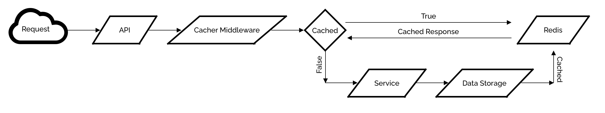

# cacher

`cacher` is an ExpressJS middleware written in TypeScript which caches responses.

## Install

`$ npm i --save @thalesfsp/cacher@vX.Y.Z`

## Usage

See `Config` in `/src/index.ts` also `src/example.ts`. Run `$ make dev` to run the example.

## Features

- Respect standard `Cache-Control` headers:
  - `no-cache`: In `GET` requests, bypass cache, and returns live response
  - `no-store`: In `GET` requests, will not cache the response
  - `max-age`:
    - In `GET` requests, communicates the TTL
    - In `GET` requests, allows to set per-request TTL
- Extend `Cache-Control` adding `delete-cache` which invalidates the cache, if any, for the given request
- Respect standard HTTP ETag
- Allows to specify a matcher:
  - Can match any combination of any request component: method || path || query params || header || everything (`*`)
- Future proof, and extensible. It allows to use any storage. Storage can be changed without changing the implementation. Current storage implemented: Redis
  - Injects storage in the request chain making it easy to use, and store data
  - Automagically cache matched responses
  - Automagically delete cache for non-GET operations (which changes data), unless `Cache-Control: persist-cache` is specified, or feature is disabled.
- Cache warmer:
  - Every N `ms`
  - One time only
  - Configurable after-start-up-delay
  - Batch request parallelize request calls speeding up the warming process
  - Configurable delay between batch calls to protect the storage from overload
- Administrative API:
  - Delete cache by key
  - Delete whole cache
  - Introspect cache by key

## How it works

A picture worth thousand words.

## Development

1. Clone repository
2. Install dependencies
   1. Run `$ npm i --save @thalesfsp/cacher`
3. Make changes
4. Validate your changes with tests
   1. Run `$ make ci`
5. Open a pull request

### CI/CD

1. Code is merged into `main`
2. `package.json` is automagically bumped
3. Code is automagically tagged
4. Release is automagically created
5. Code is automagically pushed to NPM private repository

It's all magic! :)

## Roadmap

- Add meta information about a cache entry, so it doesn't get warmed many times
- Add `urlsFromFile` option to `config.warmer` to support:
- `APIFilepath`: Swagger API filepath
- `HARFilepath`: Network filepath
